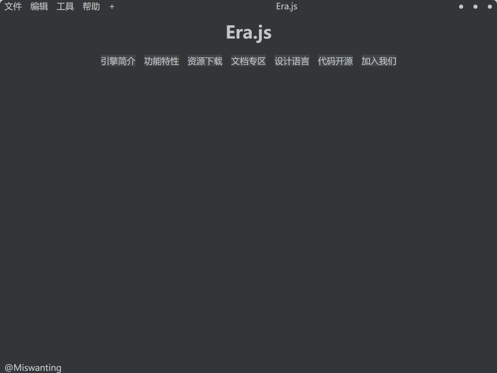

Language:&ensp;<a href='README-zh.md'>zh</a>&ensp;<abbr title='Need to be translated!'>en</abbr>&ensp;<a><abbr title='Need to be translated!'>jp</abbr></a>

    <a href="http://erajs.net">Homepage</a> |
    <a href="https://github.com/miswanting/Era.js/wiki">Doc</a> |
    <a href="https://github.com/miswanting/Era.js/projects">Roadmap</a> |
    <a href="https://github.com/miswanting/Era.js/issues">Support</a> |
    <a href="https://github.com/miswanting/Era.js/issues">FAQ</a>

</img>

<h1 align="center">Era.js</h1>

Latest Version: v0.2.0-200920

The following contents is a description of the development target. The current progress is subject to the progress shown in <a href="https://github.com/miswanting/Era.js/projects">Roadmap</a>

## Overview

>   Description Updated on: 200920

Era.js is a next-generation cross-platform rich text game engine built by JavaScript + Python3, with Python3 as the game script. It is developed based on the Electron application platform and ~~Semantic UI style library.~~Deleted on 200326, <a href='Documents/en/FAQ.md'>Why?<a> homemade style library.

## Notice

Work In Heavy Progress. Ultra-Experimental.

## Development Philosophy

- make full use of HTML5 technology to create a gorgeous, neat, rich, full of design sense of the game front end;
- carefully set up the API so that game developers can worry less about things that have nothing to do with content or gameplay;
- all code cross-platform;
- the development environment, packaging and deployment must be simple and reliable;
-friendly to secondary development;
- in principle, do not cut off any functionality provided by the technology used.
- use the latest technology.

## Features

- Easy to Operate
  - Introduced HTML5 interface logic, easy to get started.
- Easy to Develop
  - API design is intuitive, concise and comprehensive;
  - The engine is development-friendly and modification-friendly;
  - Typography, graphics, video, audio and other functions will be supported by the game engine native in the future.

## Tech Stack

### Core

- The front-end language：[JavaScript]()
  - User Interface Framework: [Vue.js 2](https://vuejs.org/)
  - Responsive style library: Span Charm(Homemade)
  - Packaging: [Electron Builder](https://www.electron.build/)
- The Back-end language(Game Script): [Python 3](https://www.python.org/)
  - Packaging: [cx_Freeze](https://anthony-tuininga.github.io/cx_Freeze/)
### Application Container for Desktop

-   Application Container: [Electron](https://electronjs.org/)

### Application Container for Mobile

-   N/A

## Platform Support

| Platform Support | Web  | Windows | MacOS | Linux | Android | iOS  |
| :--------------: | :--: | :-----: | :---: | :---: | :-----: | :--: |
|    Engine dev    |  ×   |    ○    |   ?   |   ○   |    ×    |  ×   |
|     Game dev     |  ×   |    ○    |   ?   |   ○   |    ×    |  ×   |
|   Game re-dev    |  ○   |    ○    |   ○   |   ○   |    ○    |  ○   |
|     Game run     |  ×   |    ○    |   ?   |   ○   |    ×    |  ×   |

## Directory Structure

-   Core: Legacy Core Code
-   Desktop Container: Application Container for Desktop
-   Mobile Container: Application Container for Mobile
-   SDK: Software Development Kit
-   docs: Documents

## Thanks

Thanks to [qsjl11](https://github.com/qsjl11)'s [pyera](https://github.com/qsjl11/pyera) for providing inspiration and reference of API name for this project;